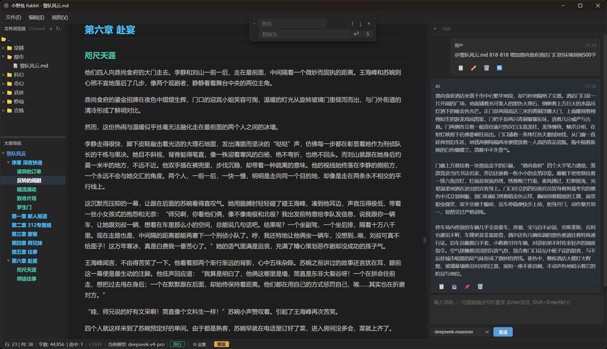

# 小野兔 Rabbit

轻量化 AI 辅助 Markdown 编辑器，专为 AI 写作者设计。

A lightweight AI-assisted Markdown editor built for writers.

> 版本 Version：v0.5.0 | License: MIT



---

## 特性 / Features

- **沉浸写作** — 深色/浅色主题可切换，所有高频操作支持快捷键
- **AI 原生** — Ctrl+K 浮动润色/续写，Ctrl+L 引用到 AI，右侧对话面板（编辑/刷新/重提交）
- **大纲驱动** — 自动解析 H1-H6 标题，彩色层级，点击跳转不抢焦点
- **本地优先** — 默认连接 llama.cpp/Ollama，支持 OpenAI / DeepSeek / Claude 等在线 API
- **Markdown 增强** — CodeMirror 6 源码增强渲染 + marked 预览模式
- **文件浏览器** — 目录树导航，右键菜单，双击重命名，点击不抢焦点
- **多模型切换** — AI 面板底部下拉选择模型，状态栏实时显示当前模型和温度
- **自定义提示词** — 设置中可编辑各模式的系统提示词

- **Immersive Writing** — Dark/light themes, high-frequency operations via keyboard shortcuts
- **AI-Native** — Ctrl+K floating polish/continue-writing, Ctrl+L quote to AI, right-side chat panel (edit/refresh/resubmit)
- **Outline-Driven** — Auto-parsed H1-H6 headings, color-coded levels, click-to-jump without stealing focus
- **Local-First** — Defaults to llama.cpp/Ollama, supports OpenAI / DeepSeek / Claude and compatible APIs
- **Markdown Enhanced** — CodeMirror 6 syntax-enhanced source mode + marked preview
- **File Browser** — Directory tree, right-click context menu, double-click rename, click without focus steal
- **Multi-Model** — Model selector in AI panel, live model name and temperature in status bar
- **Custom Prompts** — Editable system prompts for each mode in Settings

---

## 安装 / Installation

### 下载使用 / Download

前往 [Releases](https://github.com/benbenzhuyi/rabbit-editor/releases) 下载对应平台的安装包：

Download the package for your platform from [Releases](https://github.com/benbenzhuyi/rabbit-editor/releases):

| Platform | File |
|----------|------|
| Windows x64 | `rabbit-editor-0.5.0-win-x64.zip`（解压后双击 `小野兔 Rabbit.exe` / Extract and run `小野兔 Rabbit.exe`） |
| Linux x64 | `rabbit-editor-0.5.0-linux-x64.tar.gz`（解压后运行 `./small-rabbit-editor` / Extract and run `./small-rabbit-editor`） |

### 开发运行 / Development

```bash
git clone https://github.com/benbenzhuyi/rabbit-editor.git
cd rabbit-editor
npm install
npm start
```

---

## AI 模型配置 / AI Model Configuration

| 模型 / Model | API Base URL | 模型名称 / Model Name |
|-------------|-------------|---------------------|
| llama.cpp | `http://localhost:8080/v1` | `local-model` |
| Ollama | `http://localhost:11434/v1` | `llama3` etc. |
| DeepSeek | `https://api.deepseek.com/v1` | `deepseek-chat` / `deepseek-reasoner` |
| OpenAI | `https://api.openai.com/v1` | `gpt-4o` / `gpt-4o-mini` |
| Claude (compatible) | Compatible API endpoint | `claude-sonnet-4-20250514` |

在设置面板（Ctrl+, 或状态栏 ⚙ 设置）中配置 API 地址、Key 和模型名称。

Configure API base URL, API Key, and model name in the Settings panel (Ctrl+, or ⚙ Settings in the status bar).

---

## 快捷键速查 / Keyboard Shortcuts

### 文件操作 / File Operations
| Shortcut | Action |
|----------|--------|
| Ctrl+N | 新建 / New File |
| Ctrl+O | 打开 / Open File |
| Ctrl+S | 保存 / Save |
| Ctrl+Shift+S | 另存为 / Save As |
| Ctrl+W | 关闭文件 / Close File |

### 编辑操作 / Edit Operations
| Shortcut | Action |
|----------|--------|
| Ctrl+Z / Ctrl+Y | 撤销 / 重做 — Undo / Redo |
| Ctrl+X / Ctrl+C / Ctrl+V | 剪切 / 复制 / 粘贴 — Cut / Copy / Paste |
| Ctrl+A | 全选 / Select All |
| Ctrl+D | 复制当前行 / Duplicate Line |
| Ctrl+Shift+K | 删除当前行 / Delete Line |
| Alt+Up / Alt+Down | 移动当前行 / Move Line Up/Down |
| Ctrl+Shift+W | 切换自动换行 / Toggle Word Wrap |

### AI 辅助 / AI Assistance
| Shortcut | Action |
|----------|--------|
| Ctrl+K | 浮动窗口快速修改 / Floating Quick Edit (polish/continue/translate) |
| Ctrl+L | 引用到 AI 对话框 / Quote Selection to AI Chat |
| Ctrl+Shift+C | 复制最后 AI 回复 / Copy Last AI Response |
| Ctrl+Shift+T | 替换选中为 AI 回复 / Replace Selection with AI Response |
| Ctrl+Shift+I | 插入 AI 回复到后方 / Insert AI Response After Selection |
| Alt+L | 聚焦 AI 输入框 / Focus AI Input |

### 视图操作 / View
| Shortcut | Action |
|----------|--------|
| Ctrl+B / Ctrl+J | 左侧边栏 / 右侧 AI 面板 — Toggle Left Sidebar / Right AI Panel |
| Ctrl+Shift+P | 源码 / 预览切换 — Toggle Source/Preview |
| Ctrl+Shift+1/2/3 | 正常 / 全屏有菜单 / 极简全屏 — Window Modes |
| F11 | 循环窗口模式 / Cycle Window Modes |
| Ctrl+Alt+T | 切换深色/浅色主题 / Toggle Dark/Light Theme |
| Ctrl+= / Ctrl+- / Ctrl+0 | 放大 / 缩小 / 重置缩放 — Zoom In/Out/Reset |

### 查找替换 / Find & Replace
| Shortcut | Action |
|----------|--------|
| Ctrl+F | 查找 / Find |
| Ctrl+H | 替换 / Replace |
| Enter / Shift+Enter | 下一个 / 上一个 — Next / Previous Match |
| Esc | 关闭 / Close |

### 大纲导航 / Outline Navigation
| Shortcut | Action |
|----------|--------|
| Alt+Shift+1~6 | 折叠到指定级别 / Collapse to Heading Level |
| Alt+Shift+9 | 展开所有 / Expand All |

### 其他 / Other
| Shortcut | Action |
|----------|--------|
| Ctrl+, | 打开设置 / Open Settings |

---

## 技术栈 / Tech Stack

- **桌面框架 / Desktop Framework**: Electron v36
- **编辑器 / Editor**: CodeMirror 6 + @codemirror/lang-markdown
- **渲染 / Rendering**: marked + highlight.js
- **构建 / Bundler**: esbuild + electron-builder
- **前端 / Frontend**: Vanilla HTML/CSS/JS (zero framework dependencies / 零框架依赖)

---

## 功能开发手册 / Development Manual

完整的功能说明、架构文档和开发指南参见 / See full documentation:

- [DEVELOPMENT_MANUAL.md](DEVELOPMENT_MANUAL.md)

---

## License

MIT
